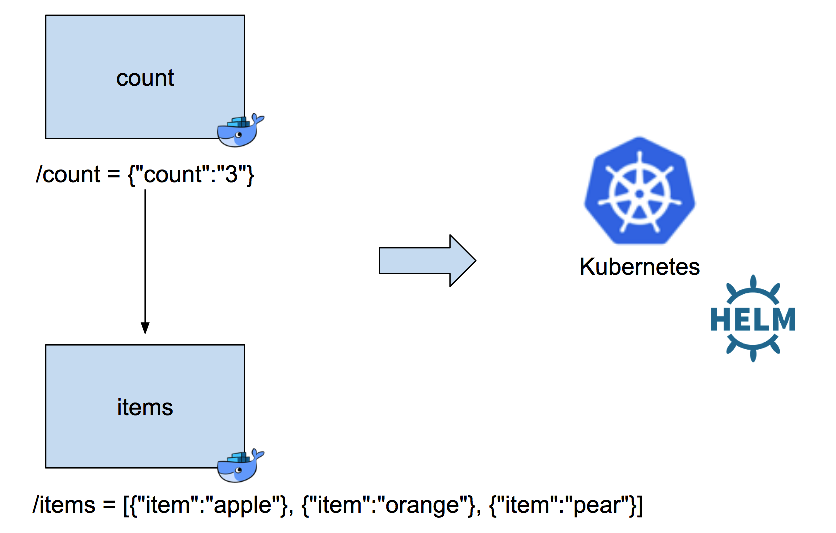

# helm-chart-tutoral

A simple tutorial which deploys two REST services to kubernetes using helm.  

```
$ docker build -t helm-chart-tutorial .
$ docker-compose up -d
Starting items ... done
Starting count ... done
$ curl localhost:8080/items
[{"item":"apple"}, {"item":"orange"}, {"item":"pear"}]
$ curl localhost:8081/count
{"count":"3"}
$ docker-compose down
Stopping count ... done
Stopping items ... done
Removing count ... done
Removing items ... done
```

Prerequisites: install docker, kubernetes and helm

Steps:
- Create helm charts
- Install charts
- Update service

### Create helm charts
```
$helm create chart
Creating chart
$ls chart
Chart.yaml	charts		templates	values.yaml
```

Edit chart/values.yaml, set the docker image and change the port
```
$vi chart/values.yaml
(make the following changes)
image:
  repository: jimareed/helm-chart-tutorial
  tag: latest

  service:
    type: ClusterIP
    port: 8080  

    hosts:
      - items.local
```

Install the chart
```
$helm install --name items ./chart
NAME:   items
LAST DEPLOYED: Fri Mar 30 19:47:30 2018
NAMESPACE: default
STATUS: DEPLOYED

RESOURCES:
==> v1/Service
NAME         TYPE      CLUSTER-IP      EXTERNAL-IP  PORT(S)         AGE
items-chart  NodePort  10.102.252.240  <none>       8080:31555/TCP  0s

==> v1beta2/Deployment
NAME         DESIRED  CURRENT  UP-TO-DATE  AVAILABLE  AGE
items-chart  1        1        1           0          0s

==> v1/Pod(related)
NAME                          READY  STATUS             RESTARTS  AGE
items-chart-6f4bbf47cb-4rx8f  0/1    ContainerCreating  0         0s


NOTES:
1. Get the application URL by running these commands:
  export NODE_PORT=$(kubectl get --namespace default -o jsonpath="{.spec.ports[0].nodePort}" services items-chart)
  export NODE_IP=$(kubectl get nodes --namespace default -o jsonpath="{.items[0].status.addresses[0].address}")
  echo http://$NODE_IP:$NODE_PORT

$helm ls
NAME         	REVISION	UPDATED                 	STATUS  	CHART              	NAMESPACE
item-count   	1       	Fri Mar 30 12:10:00 2018	DEPLOYED	chart-0.1.0        	default  
```

Try out the service
```
$ kubectl get pods
NAME                                                      READY     STATUS              RESTARTS   AGE
items-chart-6f4bbf47cb-4rx8f                              0/1       Running             1          1m
$ kubectl port-forward items-chart-6f4bbf47cb-4rx8f 8081:8080
Forwarding from 127.0.0.1:8081 -> 8080
(from a new terminal session)
$curl localhost:8081/items
[{"item":"apple"}, {"item":"orange"}, {"item":"pear"}]
```

Clean up after done
```
helm delete item-count
release "item-count" deleted
$ helm del --purge item-count
release "item-count" deleted
$docker system prune -a
```
