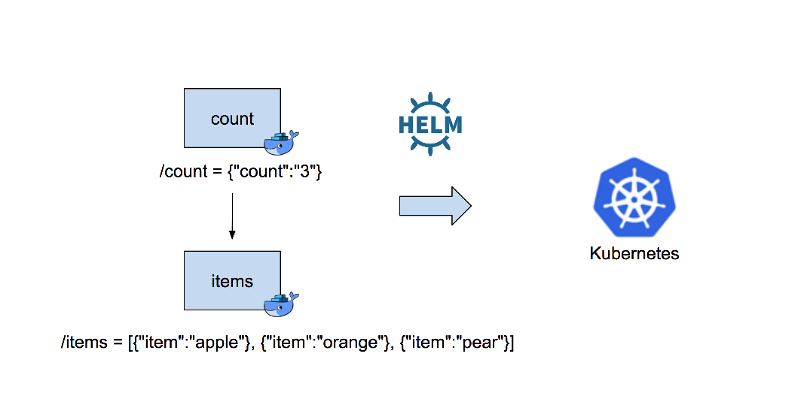

# helm-chart-tutoral

Deploy two REST services to kubernetes using helm.  
**Prerequisites**: install docker, kubernetes and helm and clone repo.


Start with the docker image which contains the two services.
```
$ docker build -t helm-chart-tutorial .
...Successfully tagged helm-chart-tutorial:latest
$ docker-compose up -d
Creating network "helmcharttutorial_default" with the default driver
Starting items ... done
Starting count ... done
$ curl localhost:8080/items
[{"item":"apple"}, {"item":"orange"}, {"item":"pear"}]
$ curl localhost:8081/count
{"count":"3"}
$ docker-compose down
Stopping count ... done
Stopping items ... done
Removing count ... done
Removing items ... done
```

Create helm charts
```
$mkdir charts
$cd charts
$helm create items
Creating items
$helm create count
Creating count
$ls items
Chart.yaml	charts		templates	values.yaml
```

Edit values.yaml, set the docker image and change the port
```
$vi items/values.yaml
(make the following changes)
image:
  repository: jimareed/helm-chart-tutorial
  tag: latest

  service:
    type: ClusterIP
    port: 8080  

$vi count/values.yaml
(make the following changes)
image:
  repository: jimareed/helm-chart-tutorial
  tag: latest

  service:
    type: ClusterIP
    port: 8080  
```

Install the charts
```
$ helm install --name items ./items
NAME:   items
LAST DEPLOYED: Sun Apr  1 09:36:21 2018
NAMESPACE: default
STATUS: DEPLOYED

RESOURCES:
==> v1/Service
NAME   TYPE       CLUSTER-IP      EXTERNAL-IP  PORT(S)   AGE
items  ClusterIP  10.104.159.218  <none>       8080/TCP  0s

==> v1beta2/Deployment
NAME   DESIRED  CURRENT  UP-TO-DATE  AVAILABLE  AGE
items  1        1        1           0          0s

==> v1/Pod(related)
NAME                    READY  STATUS             RESTARTS  AGE
items-8694fb7d76-595fx  0/1    ContainerCreating  0         0s

NOTES:
1. Get the application URL by running these commands:
  export POD_NAME=$(kubectl get pods --namespace default -l "app=items,release=items" -o jsonpath="{.items[0].metadata.name}")
  echo "Visit http://127.0.0.1:8080 to use your application"
  kubectl port-forward $POD_NAME 8080:80

$ helm install --name count ./count
NAME:   items
...

$helm ls
NAME         	REVISION	UPDATED                 	STATUS  	CHART              	NAMESPACE
count        	1       	Sun Apr  1 09:39:07 2018	DEPLOYED	count-0.1.0        	default  
items        	1       	Sun Apr  1 09:36:21 2018	DEPLOYED	items-0.1.0        	default  
```

Try out the service
```
$ kubectl get pods
NAME                                                      READY     STATUS              RESTARTS   AGE
count-77fc7b58c9-7rrb4                                    0/1       Running             3          2m
items-8694fb7d76-595fx                                    0/1       CrashLoopBackOff    5          5m
$ kubectl port-forward items-8694fb7d76-595fx 8081:8080
Forwarding from 127.0.0.1:8081 -> 8080
(from a new terminal session)
$curl localhost:8081/items
[{"item":"apple"}, {"item":"orange"}, {"item":"pear"}]
$ kubectl port-forward count-77fc7b58c9-7rrb4 8081:8080
Forwarding from 127.0.0.1:8081 -> 8080
(from a new terminal session)
$curl localhost:8081/count
{"count":"3"}
```

Clean up after done
```
$ helm delete items
release "items" deleted
$ helm del --purge items
release "items" deleted
$ helm delete count
release "count" deleted
$ helm del --purge count
release "count" deleted
```
